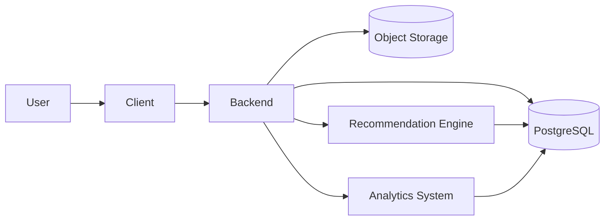

# 🌳 Sarv (سرو)

<a href="README_FA.md">فارسی</a>

---

A backend-oriented intelligent social feed platform built as a university project focusing on scalable architecture, recommendation systems, and user interaction analytics.

---

Sarv is designed as a simplified but realistic social media backend, similar in concept to platforms like X (Twitter). The main idea is to simulate how modern social feeds are generated and personalized using both traditional backend logic and an intelligence layer.

The system is built around a Java Spring Boot backend that handles core responsibilities such as authentication, user management, posts, and feed generation. On top of that, a separate Python-based intelligence layer is responsible for ranking and analyzing content based on user behavior and interactions. All persistent data is stored in PostgreSQL, while media files are managed through external object storage.

The repository is structured as a monorepo. The backend lives under `backend/`, the intelligence modules are under `intelligence/`, and all project documentation is located in `docs/`. The documentation itself is multilingual, with English and Persian versions, and is deployed automatically through GitHub Pages.

A high-level view of the system looks like this:

---

The full documentation, including architecture details, database design, and system workflows, is available on GitHub Pages:

https://ferigeek.github.io/sarv/