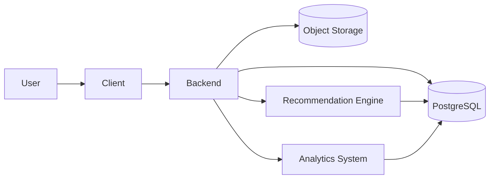

# 🌳 سرو (Sarv)
  

    <a href="README.md">English</a>

---

یک پلتفرم هوشمند شبکه اجتماعی سمت‌بک‌اند است که به عنوان یک پروژه دانشگاهی طراحی شده و بر معماری مقیاس‌پذیر، سیستم‌های پیشنهاددهنده و تحلیل تعاملات کاربران تمرکز دارد.

---

سرو به عنوان یک بک‌اند ساده‌شده اما واقع‌گرایانه از یک شبکه اجتماعی طراحی شده است، مشابه پلتفرم‌هایی مانند X (توییتر). هدف اصلی این پروژه شبیه‌سازی نحوه تولید و شخصی‌سازی فیدهای مدرن با استفاده از منطق بک‌اند و یک لایه هوشمند است.

این سیستم بر پایه‌ی بک‌اند Java Spring Boot ساخته شده که مسئولیت‌هایی مانند احراز هویت، مدیریت کاربران، پست‌ها و تولید فید را بر عهده دارد. در کنار آن، یک لایه هوشمند مبتنی بر Python وظیفه رتبه‌بندی و تحلیل محتوا را بر اساس رفتار و تعاملات کاربران انجام می‌دهد. تمامی داده‌های پایدار در PostgreSQL ذخیره می‌شوند و فایل‌های رسانه‌ای از طریق object storage خارجی مدیریت می‌شوند.

ساختار ریپازیتوری به صورت monorepo طراحی شده است. بخش backend در مسیر `backend/` قرار دارد، ماژول‌های هوش مصنوعی و تحلیل در مسیر `intelligence/` هستند و تمام مستندات پروژه در پوشه `docs/` قرار گرفته‌اند. این مستندات به صورت دو زبانه (انگلیسی و فارسی) نوشته شده‌اند و به صورت خودکار از طریق GitHub Pages منتشر می‌شوند.

نمای کلی سیستم به شکل زیر است:

---

مستندات کامل پروژه، شامل جزئیات معماری، طراحی پایگاه داده و جریان‌های سیستم، در GitHub Pages در دسترس است:

https://ferigeek.github.io/sarv/