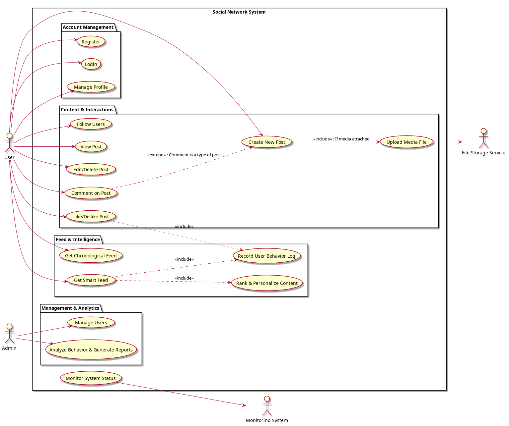

# Requirements

## Introduction

This section is part of the documentation written and presented during the "Analysis and Design" phase. The purpose of this document is to define the system requirements, project scope, high-level architecture, key scenarios, and the tools used in this project. 

This document serves as the foundation for subsequent development phases, including detailed architectural design, system implementation, and the incremental development of features.

## Project Scope

The target system is intended for general public use. This social network is not exclusive to a specific organization or group of individuals; any user will be able to utilize this product for any purpose or topic.

However, the primary scope of this project is focused on the design and implementation of the system's server-side. In other words, the core focus is on developing the backend infrastructure and core system logic, rather than the user interface or end-user clients.

### In-Scope Items

The following components are within the implementation scope of this project:

* Design and implementation of APIs for communication with clients and external services.
* User management and related user data storage.
* Management and storage of posts and user-generated content.
* Implementation of user interaction systems, including likes, comments, and follows.
* Design and implementation of the feed system to display content to users.
* Implementation of an intelligent module (ranking / recommendation system) for content personalization.
* User behavior analytics system and infrastructure status reporting.
* Design and implementation of the database structure and system data models.

### Out-of-Scope Items

Deliberately, certain components have been excluded from the initial phase of this project:

* Full development of end-user clients (web or mobile applications).
* UI/UX graphical user interface design.
* Large-scale deployment and complex distributed production infrastructure.
* Full-scale enterprise DevOps implementation for production environments.

While these items can be integrated into the system in later development phases, the current focus remains on designing a scalable, modular, and upgradeable backend system that can expand in the future without requiring fundamental architectural changes.

## Use Cases

### System Boundary

The target system is a backend engine for a social network responsible for managing users, content, interactions, feed generation, smart ranking, data analytics, and monitoring.

All application logic, algorithmic processing, and inter-service communications (such as Java and Python interoperability) reside **inside the system boundary**. Users, administrators, and independent external infrastructures interact with this boundary as **external entities (Actors)**.

### Actors

In this architecture, actors are strictly external entities that either initiate a goal within the system or are dependencies the system relies on to complete a workflow:

* **User:** The primary actor who interacts with the platform to create posts, like content, follow other users, and fetch their feed.
* **Admin:** The primary administrative actor responsible for monitoring overall system behavior, receiving high-level reports, and moderating/blocking violating users.
* **File Storage Service:** A secondary, external actor (such as an independent Object Storage service) that the system connects to for storing and retrieving media assets.
* **Monitoring System:** A secondary, external actor (such as Prometheus/Grafana) that collects and monitors critical system metrics.

### Use Case Categorization

1. **Account Management:** Registration, login, and profile management.
2. **Content & Interactions:** Post creation, viewing posts, editing/deleting posts, commenting, liking/disliking, and following users.
3. **Feed & Intelligence:** Chronological feed retrieval, smart feed retrieval (including internal ranking and behavior logging sub-processes).
4. **Management & Analytics:** Admin user management, behavior analysis, and statistical report generation.
5. **Infrastructure:** Technical health and service monitoring.

### Use Case Table

| ID        | Use Case Title             | Primary/Secondary Actor | Process Description                                                 |
| :-------- | :------------------------- | :---------------------- | :------------------------------------------------------------------ |
| **UC-01** | Register                   | User                    | Creates a new user account in the system.                           |
| **UC-02** | Login                      | User                    | Authenticates the user and issues an access token (JWT).            |
| **UC-03** | Manage Profile             | User                    | Views and updates personal profile information.                     |
| **UC-04** | Create New Post            | User / File Storage     | Publishes new textual or media content.                             |
| **UC-05** | View Post                  | User                    | Displays the content of a specific post.                            |
| **UC-06** | Edit/Delete Post           | User                    | Modifies or removes posts owned by the user.                        |
| **UC-07** | Comment on Post            | User                    | Submits a reply or comment on another post.                         |
| **UC-08** | Like/Dislike Post          | User                    | Registers a positive or negative interaction on posts.              |
| **UC-09** | Follow Users               | User                    | Establishes a follow relationship between two users.                |
| **UC-11** | Get Chronological Feed     | User                    | Retrieves a list of posts ordered strictly by timestamps.           |
| **UC-12** | Get Smart Feed             | User                    | Retrieves a personalized and ranked content feed.                   |
| **UC-13** | Rank & Personalize Content | *Internal (System)*     | Internal post ranking execution handled by the Python module.       |
| **UC-15** | Record User Behavior Log   | *Internal (System)*     | Automated logging of user interactions for AI/ML models.            |
| **UC-16** | Analyze Behavior & Reports | Admin                   | Processes offline logs and displays analytics to the admin.         |
| **UC-18** | Monitor System Status      | Monitoring System       | Continuously tracks system health, errors, and resources.           |
| **UC-19** | Manage Users               | Admin                   | Allows the admin to block or restrict user accounts.                |
| **UC-20** | Upload Media File          | User / File Storage     | Intermediary process to transfer images/videos to external storage. |

### Key Scenarios

#### 1. Get Smart Feed

* **Actors:** User
* **Preconditions:** The user is logged in and provides a valid JWT access token.
* **Main Flow:**
    1. The user sends a request to the API to retrieve their smart feed.
    2. The system validates the user's JWT token.
    3. The system fetches recent candidate posts from the database.
    4. The system internally invokes the intelligence layer (Python) to rank and personalize the posts for this specific user.
    5. Simultaneously, the system asynchronously records a behavior log for this request.
    6. The sorted, personalized results are returned to the user in a paginated JSON format.
* **Alternative Flow (Fallback):**
    * If the Python intelligence service is unavailable or an algorithmic computation error occurs, the system automatically falls back to **UC-11 (Get Chronological Feed)**, serving posts sorted purely by time to guarantee uninterrupted service availability (**Graceful Degradation**).

#### 2. Create New Post

* **Actors:** User, File Storage Service (Secondary)
* **Preconditions:** The user is authenticated.
* **Main Flow:**
    1. The user submits textual content along with a media file (if applicable).
    2. The system validates the file format and size limits.
    3. The system uploads the file to the external File Storage Service and receives a secure, unique asset URL.
    4. The post's metadata and text are saved in the PostgreSQL database along with the media URL.
    5. A success confirmation is sent back to the user.
* **Alternative Flow:**
    * If the connection to the external File Storage Service fails, the entire transaction is rolled back, the post is not created, and an upload error message is returned to the user.

#### 3. Like/Dislike Post

* **Actors:** User
* **Preconditions:** The user is authenticated, and the target post exists in the system.
* **Main Flow:**
    1. The user triggers a like or dislike action on a post.
    2. The system checks the user's previous interaction status with this post.
    3. The new state is saved or updated in the database.
    4. The system sends an asynchronous signal to **UC-15 (Record User Behavior Log)** to factor this interaction weight into future feed recommendations.
* **Postconditions:** The post's total like/dislike counters are updated, and the interaction state is persisted.

#### 4. Analyze Behavior & Generate Reports

* **Actors:** Admin
* **Preconditions:** Sufficient interaction data and behavior logs have been collected over time.
* **Main Flow:**
    1. The admin requests a statistical report (e.g., peak activity hours or trending topics).
    2. The core system delegates the request to the data analytics subsystem (Python Analytics).
    3. The analytics service aggregates and processes raw log volumes from the data store.
    4. A structured analytical report is generated and displayed to the admin via graphs and statistical tables.

### Use Case Relationships

* **Include Relationship:** The execution of `Get Smart Feed (UC-12)` always includes the internal executions of `Rank & Personalize Content (UC-13)` and `Record User Behavior Log (UC-15)`.
* **Extend Relationship:** `Comment on Post (UC-07)` is a specialized workflow that extends the base `Create New Post (UC-04)` scenario (as a comment structurally mirrors a post but extends it by referencing a parent post ID).

### Use Case Diagram



### Critical Scenarios

The system must maintain stability and demonstrate predictable behavior under the following failure modes:
1. **Python Layer Outage (Recommendation Failure):** The core system must seamlessly catch this exception and default to the simple chronological feed (UC-11) without crashing.
2. **Sudden Traffic Spikes:** During massive user concurrency, the system must utilize database Caching layers and strict Pagination limits to protect the database from connection exhaustion.
3. **Primary Database Outage:** In case of a database failure, the monitoring infrastructure (UC-18) must immediately dispatch high-priority alerts to the admin while the gateway returns a standard, structured HTTP 503 (Service Unavailable) error to clients.
4. **Graceful Degradation:** Under extreme CPU/Memory resource constraints, the system is authorized to temporarily throttle or deactivate heavy background processing components (such as UC-16 offline analytics) to preserve computing power for critical path requests (UC-12 feed generation and UC-04 posting).

## Functional Requirements

### User Management

The system provides registration, login, and logout functionalities for users. User account data is securely persisted, allowing users to view and retrieve their profile information. Additionally, specific account attributes can be modified by the profile owner.

Furthermore, administrative account moderation tools are provided, enabling the system administrator to restrict or suspend user accounts to manage and control malicious platform behavior.

### User Interactions

Users are granted the capability to publish posts consisting of text, images, and videos. Other users viewing these posts can express appreciation or disapproval (likes/dislikes). Total interaction counters for each post are publicly visible.

Users can also comment on any post. Each "comment" is structurally treated as a post entity, carrying the same base properties, with the distinction that it depends on one or more parent posts and acts as a contextual reply or a continuation of a conversation thread.

Additionally, users can follow other accounts to prioritize their content within their personal feeds. All user interaction data is persisted and indexed by the system to feed downstream recommendation and ranking modules.

### Feed System

The feed system is responsible for compiling and serving content that aligns closest with user preferences. Utilizing data stores, historical interactions, social graphs, and system states, it computes which posts to display and determines their specific ordering per user.

Given the potential scale of raw posts, the feed must be processed incrementally and served via API pagination, allowing the client application to fetch records sequentially. The system supports multiple feed filters:

* Following Feed (content from followed accounts)
* Trending/Popular Feed (high interaction content)
* Chronological Feed (latest updates)

### Ranking & Recommendation System

This component analyzes ingested interaction logs to evaluate the relevance score of individual posts for different users. Using implicit signals, post popularity, user affinity graphs, and historical behaviors, it prioritizes relevant items over static listings.

The underlying models and algorithms are designed to be highly modular, allowing iterative updates during development. The initial launch emphasizes establishing a decoupled architecture to test and hot-swap basic ranking methodologies easily.

### User Analytics and Statistics

This subsystem processes user activities and platform metrics to surface actionable business intelligence and high-level analytical reports for administrators. Key metrics include:

* Daily Active Users (DAU) / Monthly Active Users (MAU)
* Peak usage hours and system load windows
* Trending topics and keywords
* High-engagement posts
* Influential content creators

The primary goal is providing complete observability into platform health and community growth trends.

### Technical Monitoring

The infrastructure monitoring framework tracks, aggregates, and logs runtime system metrics to guarantee complete application observability. Tracked data vectors include:

* Inbound HTTP request rates, response distributions, and latency percentiles (p95, p99)
* System resource utilization (CPU, Memory, Disk I/O, Database connection pools)
* Application exceptions and system stack traces
* Critical state changes and auditable infrastructure events

This monitoring layer serves to accelerate troubleshooting, optimize resource allocation, and maximize system uptime.

### API

The system exposes a unified, predictable API layer to handle client applications and third-party integrations. Data exchange adheres strictly to the JSON format to maximize cross-platform compatibility.

The interface follows REST architectural principles, featuring deterministic endpoint routing, standard HTTP status codes, and comprehensive OpenAPI/Swagger documentation detailing request/response payloads.

### Data Management

All core system entities—including user credentials, posts, social graphs, and analytical data—are persistently managed across optimized data stores. The system enforces relational integrity across structural schemas.

Structured operational data (users, posts, relations) is stored in a relational database engine. Conversely, heavy unstructured blobs (images, video files) are handled out-of-band via specialized asset management storage configurations. The underlying schemas are explicitly designed for backward-compatible migrations.

## Non-Functional Requirements

### Performance and Efficiency

The system must process inbound client requests within low latency thresholds to ensure a responsive end-user experience. Since workflows involve algorithmic feeds and multi-table interactions, optimization directly influences user retention.

To minimize latency, downstream queries must be highly optimized, avoiding heavy synchronous computations on the request-response thread. Long-running or heavy side-effects must be processed asynchronously using background workers or message queues. Techniques such as pagination, optimized query execution plans, index tuning, and database connection pooling are strictly enforced to maximize throughput under heavy parallel workloads.

### Scalability

The architecture must scale gracefully alongside expanding user volumes, data ingestion rates, and request frequencies without requiring structural code refactoring.

Given the high-throughput nature of social network workloads, modules must be highly independent and follow clean separation principles. This loose coupling ensures components can be isolated, optimized, or scaled horizontally. Where read volumes peak, caching strategies, paginated index scans, and database query optimizations must be applied to prevent system bottlenecks.

### Extensibility and Maintainability

The codebase must minimize structural coupling to lower long-term maintenance costs and facilitate effortless feature additions. Because this project blends a robust core backend with modular intelligence and analytical nodes, code isolation is paramount.

Separation of Concerns (SoC) stands as a foundational constraint. Every software component maintains a strict, bounded context with minimal dependencies on adjacent layers. Clean, layered directory boundaries and declarative domain boundaries ensure that localized updates do not cause systemic regression issues.

### Reliability and High Availability

The system must guarantee runtime resilience under fluctuating environment conditions. Severe slowdowns, cascading exceptions, or runtime crashes heavily compromise application reliability.

Defensive programming, strict input validation, graceful exception handling, and robust logging are required at all entry points. Fault isolation boundaries must prevent a failure in a peripheral subsystem (such as analytics or recommendations) from compromising core business operations (such as user authentication or basic posting capabilities).

### Security and Privacy

While absolute security is an ongoing target, the application explicitly mitigates common software vulnerabilities (such as the OWASP Top 10) by enforcing secure defaults from the ground up. Threat modeling guides the design of secure entry paths for data access.

Data privacy principles dictate strict access controls across all service communication boundaries. Secure token-based authentication (JWT) prevents unauthorized data scraping, ensuring that private information exposure is tightly checked during transmission across external or internal system channels.

### Monitoring and Observability

In a platform combining multiple runtime environments (such as Java Spring and Python intelligence nodes), basic application logging is insufficient for analyzing system health. Complete runtime observability is a key system requirement.

The platform relies on structured logging and metric aggregation to trace user execution flows, analyze request patterns, and expose processing bottlenecks under heavy loads. This real-time visibility enables data-driven optimization choices over design-time assumptions.

### Documentation

Comprehensive, version-controlled documentation is a strict delivery requirement. Detailed technical walk-throughs and clear endpoint mappings ensure the platform remains maintainable for future extensions and simplifies debugging phases.

### Compatibility and Interoperability

The backend must run agnostically across varied client environments, networks, and operating systems. System boundaries communicate through standard REST channels using JSON payloads, detaching internal backend choices from client-side frameworks.

Internal inter-service boundaries (the Java core interacting with Python nodes) rely on clean, deterministic contracts, ensuring either system can undergo isolated refactoring or language upgrades without breaking communication states. Deployment configurations are tailored for modern Linux distributions.

### Data Integrity and Accuracy

Maintaining absolute relational consistency across all entity lifecycles is a fundamental constraint. Invalidation or orphaned states across users, posts, or social graphs can cause systemic logic failures in downstream analytical modules.

Database-level constraints, relational foreign keys, and transactional boundaries ensure that compound operations (such as deleting a post alongside its associated comments and interactions) execute atomically, preventing data corruption or state divergence.

### Testability and Evaluation

The system must be designed from the start to support automated verification. Decoupled, modular code structures ensure that separate layers can be mocked and validated independently through automated testing suites.

Beyond standard unit testing, the platform must accommodate isolated performance profiling on data-heavy routes (like the feed generation path) to evaluate algorithmic efficiency under load load scenarios before promotion to production.

### Fault Tolerance and Graceful Degradation

The application architecture enforces strict **Fault Isolation**. The system boundary isolates failures to their originating domain, preventing a crash in peripheral systems from causing a cascading failure across the network.

If an auxiliary component experiences a downtime, the system transitions into a **Graceful Degradation** state, reducing the richness of the user experience (e.g., swapping an AI feed for a simple time-sorted query) rather than presenting a hard system error to the client.

## System Architecture

Detailed architectural breakdowns, system design patterns, and deployment topologies are thoroughly documented within the [[docs/en/3-Architecture|3-Architecture]] directory of the project documentation. This section transitions from high-level infrastructure layouts into the fine-grained implementation mechanics of individual system nodes.

## Repository Structure

The project utilizes a unified repository structure (**Monorepo**) categorized by specialized domain responsibilities to optimize single-developer management workflows while keeping service code strictly decoupled:

```text
social-network-platform/
│
├── backend/               # Main Application Logic & Data Management (Java/Spring Boot)
│
├── intelligence/          # Data Processing & Intelligent Services (Python)
│   ├── recommendation/    # Smart Ranking & Personalized Feed Algorithms
│   └── analytics/         # Offline Log Processing & User Behavior Metrics
│
├── docs/                  # Project Documentation & Markdown files (MkDocs)
│
└── other files and configurations ...
```

## Tools and Technologies Used

- **Java & Spring Framework:** 
	  The core backend platform is engineered using Java and the Spring Boot ecosystem. Java's compiled nature, rigorous compile-time type-checking, and enterprise-grade maturity guarantee a robust, highly stable foundation for complex business logic. Spring Boot provides the standardized industry architecture for dependency injection, REST API routing, security controls, and transaction management, promoting clean, modular application layers.
- **Python:** 
	  The platform's intelligence layer (encompassing recommendation and analytics engines) is developed in Python. Python's clean syntax, rapid prototyping speed, and dominant data processing ecosystem make it the ideal choice for data heavy tasks. This layer heavily utilizes optimized vector and analytics libraries including `numpy`, `pandas`, and `scikit-learn` to process interaction logs and execute ML ranking models.
- **PostgreSQL:** 
	  Serves as the primary object-relational database management system (ORDBMS). Chosen for its enterprise reliability, complex query optimization engines, and robust ACID transaction guarantees, it safely handles relational social graphs, user states, and core platform content.
- **Markdown & MkDocs:** 
	  Technical documentation follows a "Documentation as Code" philosophy, written in lightweight Markdown and built into an accessible, searchable static documentation website using the MkDocs static site generator.
- **Git & GitHub:** 
	  Employed exclusively for source code version control, feature branch isolation, commit history auditing, and structured repository codebase management.
- **Grafana & Prometheus:** 
	  Integrated to provide a full-scale open-source system observability stack. Prometheus acts as the time-series data store collecting runtime application metrics, while Grafana provisions real-time monitoring dashboards to visualize infrastructure health, error rates, and resource utilization profiles.

