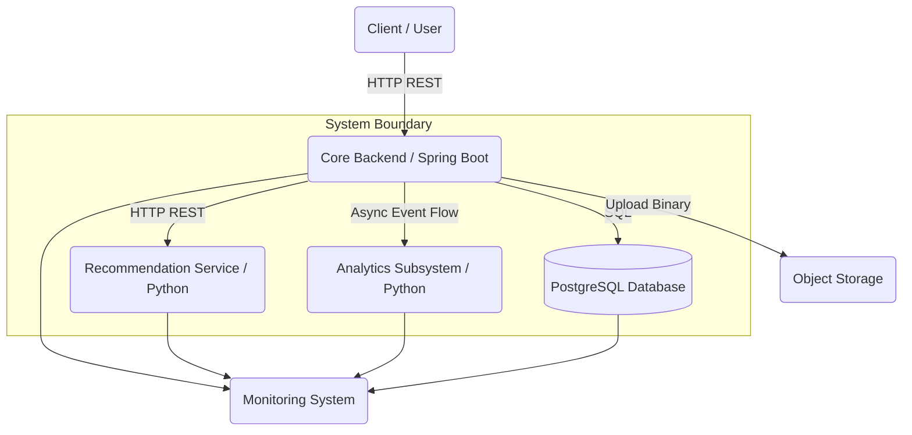

# System Architecture

This document describes the overall structure and architecture of the system. It first presents the high-level architecture and major system components, then examines the internal structure of each subsystem, their interactions, and the flow of data throughout the platform.

The architecture of this project is based on separation of responsibilities. The core business logic, data management, and API layer are implemented using Java and Spring Boot, while data analysis, content ranking, and intelligent processing are implemented in Python. This separation allows each subsystem to evolve independently while preventing computationally intensive analytical workloads from directly affecting the performance of the core application.

---
## High-Level System Architecture

The system consists of several major components, each responsible for a specific set of tasks.

The Core Backend acts as the entry point for all user requests. User management, content management, interactions, authentication, authorization, and feed generation are all handled through this component.

Alongside the Core Backend, an Intelligence Layer is responsible for intelligent data processing. This layer consists of two independent subsystems. The Recommendation System is responsible for content ranking and personalization, while the Analytics Subsystem processes user behavior data and generates statistical insights.

All structured application data is stored in PostgreSQL. Large media files such as images and videos are stored in an external file storage solution or object storage service, while only their metadata and references are maintained in the database.

A Monitoring Subsystem is also included to collect operational metrics and provide visibility into the runtime behavior of the platform.

---
## Communication Between Subsystems

All user requests first enter the Core Backend. The backend is responsible for request validation, authentication, business logic execution, data management, and coordination between other subsystems.

Whenever content ranking is required, the backend sends the necessary information to the Recommendation System and receives ranked results. This communication is performed synchronously because the ranking results are directly required to generate the final response returned to the user.

Communication with the Analytics Subsystem is performed asynchronously. User behavior events are recorded during system operation, while analytical processing is executed later in separate workflows. This prevents analytical workloads from increasing request latency for end users.

The Monitoring Subsystem operates outside the primary request-processing path and continuously collects operational metrics from the various services.

---
## Core Backend

The Core Backend is the central component of the system and is responsible for executing the primary business logic.

All user requests pass through this subsystem, and all major platform operations are coordinated from here.

The backend is implemented using Spring Boot and follows a layered architecture. Incoming HTTP requests are processed in the presentation layer, where authentication, authorization, validation, and access control are performed. Business logic is executed within the service layer, while data persistence and retrieval are handled through the data access layer.

This separation of concerns improves maintainability and allows individual layers to evolve independently with minimal impact on other parts of the system.

The Core Backend is responsible for user management, profiles, posts, comments, user interactions, follow relationships, feed generation, and communication with external subsystems.

When a user creates a new post, the backend first validates the incoming request. If media files are attached, the files are uploaded to external object storage and a storage reference is returned. The post data and media references are then stored in PostgreSQL.

When generating a feed, the backend retrieves candidate content from the database and, when necessary, delegates ranking operations to the Recommendation System.

---
## Recommendation System

The Recommendation System is responsible for content personalization and feed ranking.

This subsystem is implemented as an independent Python service and does not manage users or store application data directly. Its sole responsibility is to receive input data, execute ranking algorithms, and return ranked results to the Core Backend.

During feed generation, the backend selects a set of candidate posts and sends them, along with the required user information, to the recommendation service. The service processes this information and computes a relevance score for each post. The posts are then sorted according to their scores and returned to the backend.

Since this subsystem does not maintain persistent internal state, multiple instances can be deployed in parallel in the future to distribute processing load and improve scalability.

If the recommendation service becomes unavailable, the backend can continue operating by falling back to a simple chronological feed without interrupting service availability.

---
## Analytics Subsystem

The Analytics Subsystem is responsible for processing user behavior data and generating statistical insights for administrators.

Unlike the Recommendation System, which operates directly within user-facing workflows, the Analytics Subsystem functions asynchronously and does not affect request response times.

User activities such as content views, likes, comments, and follow actions are recorded during normal system operation. These events are periodically processed to generate analytical information and system-wide metrics.

The resulting insights can be used for administrative reporting, user behavior analysis, platform activity monitoring, and evaluation of recommendation algorithms.

Separating analytics from the main application ensures that computationally intensive analytical workloads do not impact the day-to-day experience of platform users while allowing both subsystems to evolve independently.

---
## Monitoring Subsystem

Monitoring is not part of the primary request-processing workflow, but it plays a critical role in operating and maintaining the platform.

All major services expose operational metrics describing their runtime behavior. These metrics include request latency, resource utilization, error rates, service availability, and other technical indicators.

Prometheus is responsible for collecting and storing these metrics, while Grafana is used for visualization, analysis, and dashboard creation.

This subsystem provides visibility into system behavior, helps identify performance bottlenecks, and supports troubleshooting and operational analysis. In the event of failures or abnormal behavior, the collected metrics provide valuable information for diagnosis and root-cause investigation.

---
## Data Storage Layer

The system uses two different storage mechanisms.

Structured data such as users, posts, comments, interactions, and social relationships are stored in PostgreSQL. These entities contain well-defined relationships and require transactional guarantees and integrity constraints that are best provided by a relational database system.

Media assets such as images and videos are stored in a dedicated object storage service. This approach prevents large binary files from being stored directly inside the database and simplifies data management.

As a result, each category of data is stored in the environment most suitable for its characteristics, improving both system performance and maintainability.