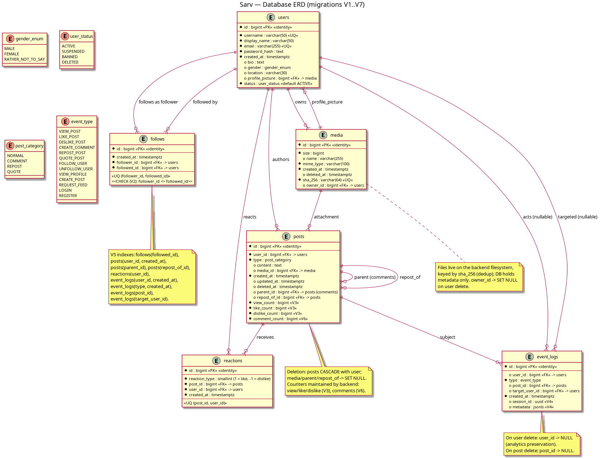

# Database Design

## Overview

This project uses PostgreSQL as the main database for a social feed platform.  
The database is designed to support users, posts, interactions, media, and event logging for analytics and machine learning.

---
## Entity Relationship Diagram (ERD)

> **Note:** the ERD image above is outdated — it does not include the changes from migrations V3 (post counters), V4 (event log session/metadata), and V5 (indexes). It needs to be regenerated from the current schema.

---
## Core Entities

### Users
Stores user account and profile information.

Key fields:
- id (primary key)
- username (unique)
- email (unique)
- password_hash
- status (active, suspended, banned, deleted)
- gender (enum)
- profile_picture (media reference)

### Posts
Represents user-generated content.

Supports multiple content types:
- NORMAL posts
- COMMENTS (via parent_id)
- REPOSTS (via repost_of_id)
- QUOTES (quote posts with additional referenced content)

Each post belongs to a user.

Posts also carry aggregate counters that are maintained by the backend:

- view_count (incremented on every single-post view and for every post served from a feed)
- like_count / dislike_count (adjusted when reactions are added, removed, or switched)
- comment_count (incremented atomically when a COMMENT on the post is created; added in V6)

### Reactions
Stores user reactions to posts.

- reaction_type:
  - 1 = like
  - -1 = dislike
- Each user can react once per post (unique constraint on post_id + user_id)

### Follows
Represents follower-following relationships between users.

- follower_id → user who follows
- followed_id → user being followed
- prevents duplicate follows (unique constraint on follower_id + followed_id)
- self-following is rejected by a CHECK constraint (follower_id <> followed_id)

### Media
Stores metadata for uploaded files. The file itself is stored on the backend's local filesystem, addressed by its SHA-256 hash; the database only holds metadata.

Includes:
- file size
- MIME type
- SHA-256 hash (unique; also used as the storage key, enabling deduplication)
- owner reference

### Event Logs
Stores user activity events for analytics and machine learning.

Used for:
- feed ranking
- behavior analysis
- recommendation systems

Examples of events:
- LOGIN
- VIEW_POST
- LIKE_POST
- CREATE_POST
- FOLLOW_USER
- REQUEST_FEED

User ID is nullable to allow anonymization.

Additional fields (added in V4):

- session_id (UUID) — groups the actions of one usage session; unrelated to JWT authentication
- metadata (JSONB) — extra event-specific information that does not deserve its own column

---
## Enums

### Gender
- male
- female
- rather_not_to_say

### User Status
- active
- suspended
- banned
- deleted

### Post Category
- NORMAL
- COMMENT
- REPOST
- QUOTE

### Event Type
- VIEW_POST
- LIKE_POST
- DISLIKE_POST
- CREATE_COMMENT
- REPOST_POST
- FOLLOW_USER
- UNFOLLOW_USER
- VIEW_PROFILE
- CREATE_POST
- REQUEST_FEED
- LOGIN

---
## Relationships

- A user can create many posts
- A user can follow many users
- A user can react to many posts
- A post can have many reactions
- A post can have comments (self-referencing)
- Posts can also quote other posts (QUOTE type)
- Media can be owned by a user
- Events are linked to users, posts, or target users (nullable)

---
## Deletion Strategy

- Users: cascade delete posts, follows, reactions
- Posts: deleted if user is deleted
- Media: ownership is set to NULL if user is deleted
- Event logs: user reference is set to NULL (for analytics preservation)

---
## Indexing Strategy (implemented)

PostgreSQL does not index foreign key columns automatically, and the existing unique constraints do not cover every lookup pattern. The following indexes are created by migration `V5`:

- follows (followed_id) — follower listings
- posts (user_id, created_at) — user timelines / feed lookups, newest first
- posts (parent_id) — comment tree navigation
- posts (repost_of_id) — repost navigation
- reactions (user_id) — per-user reaction history (complements the unique post_id + user_id constraint)
- event_logs (user_id, created_at) — per-user activity timelines for analytics
- event_logs (type, created_at) — hot-topic / peak-usage aggregations
- event_logs (post_id), event_logs (target_user_id) — entity-scoped analytics queries

---
## Notes

- Event logs are designed for machine learning and recommendation systems
- Soft deletion is supported via deleted_at fields in posts and media
- The schema is optimized for read-heavy workloads (feed generation)

