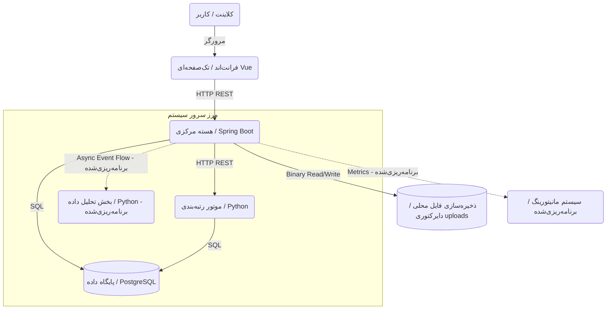
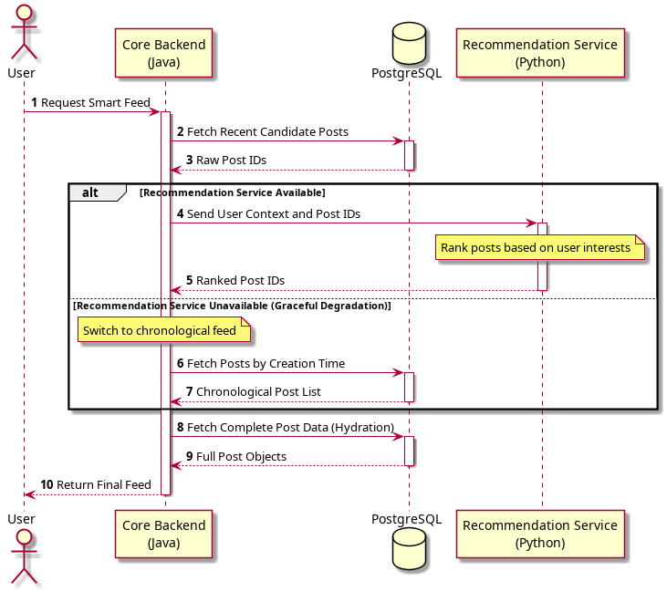

# معماری سیستم

این مستند ساختار کلی و معماری سیستم را توضیح می‌دهد. ابتدا معماری کلان و اجزای اصلی سیستم معرفی می‌شوند و سپس ساختار داخلی هر یک از زیرسیستم‌ها، نحوه تعامل آن‌ها با یکدیگر و جریان داده در بخش‌های مختلف بررسی می‌شود.

معماری این پروژه بر پایه جداسازی مسئولیت‌ها طراحی شده است. منطق اصلی برنامه، مدیریت داده‌ها و ارائه APIها در بخش Java/Spring Boot قرار دارند و بخش‌های مرتبط با تحلیل داده، رتبه‌بندی محتوا و پردازش‌های هوشمند در Python پیاده‌سازی می‌شوند. این جداسازی باعث می‌شود هر بخش متناسب با نیازهای خود توسعه پیدا کند و پردازش‌های سنگین تحلیلی بر عملکرد بخش اصلی سیستم تأثیر مستقیم نگذارند.

---
## معماری کلان سیستم

سیستم از چند بخش اصلی تشکیل شده است که هر کدام مسئولیت مشخصی بر عهده دارند.

هسته مرکزی سیستم نقطه ورود تمامی درخواست‌های کاربران است. تمامی عملیات مرتبط با مدیریت کاربران، مدیریت محتوا، تعاملات، احراز هویت و تولید فید از طریق این بخش انجام می‌شود.

در کنار هسته مرکزی، یک لایه هوشمند قرار دارد که شامل دو زیرسیستم مستقل است. زیرسیستم Recommendation مسئول رتبه‌بندی و شخصی‌سازی محتوا برای کاربران بوده و زیرسیستم Analytics وظیفه تحلیل داده‌ها و استخراج اطلاعات آماری را بر عهده دارد.

تمام اطلاعات ساخت‌یافته سیستم در PostgreSQL ذخیره می‌شوند. فایل‌های رسانه‌ای مانند تصاویر و ویدیوها روی فایل‌سیستم محلی هسته مرکزی نگهداری می‌شوند (دایرکتوری اختصاصی که در استقرار کانتینری به‌صورت volume در اختیار سرویس قرار می‌گیرد) و تنها اطلاعات مربوط به آن‌ها در پایگاه داده ثبت می‌شود.

همچنین یک زیرسیستم مانیتورینگ برای جمع‌آوری اطلاعات عملکردی و مشاهده وضعیت داخلی سرویس‌ها در نظر گرفته شده است تا رفتار سیستم در زمان اجرا قابل بررسی و تحلیل باشد. این زیرسیستم برنامه‌ریزی‌شده است و هنوز مستقر نشده است.

فلش‌های توپر ارتباطات پیاده‌سازی‌شده و فلش‌های خط‌چین ارتباطات طراحی‌شده‌ی پیاده‌سازی‌نشده را نشان می‌دهند.

---
## ارتباط میان زیرسیستم‌ها

تمامی درخواست‌های کاربران ابتدا وارد هسته مرکزی سیستم می‌شوند. هسته مرکزی مسئول اعتبارسنجی درخواست‌ها، مدیریت داده‌ها و هماهنگی میان سایر بخش‌ها است.

در مواردی که نیاز به رتبه‌بندی محتوا وجود داشته باشد، هسته مرکزی اطلاعات مورد نیاز را به زیرسیستم Recommendation ارسال می‌کند و نتیجه رتبه‌بندی را دریافت می‌کند. این ارتباط به صورت همزمان انجام می‌شود زیرا نتیجه آن مستقیماً در پاسخ نهایی به کاربر مورد استفاده قرار می‌گیرد.

> **توجه:** یکپارچه‌سازی بین هسته مرکزی و سرویس Recommendation اکنون پیاده‌سازی شده است (`GET /api/feed/recommended` → `GET http://recommendation:8000/feed?user_id=&page=&size=` از طریق `RestClient` با تخریب مهربانانه). نمودار توالی زیر جریان فید هوشمند را نشان می‌دهد.

در مقابل، ارتباط با زیرسیستم Analytics به صورت غیرهمزمان انجام می‌شود. اطلاعات رفتاری کاربران در زمان اجرای سیستم ثبت می‌شوند اما پردازش آن‌ها در زمان دیگری انجام می‌شود تا عملیات تحلیلی باعث افزایش زمان پاسخگویی به کاربران نشود.

زیرسیستم مانیتورینگ نیز خارج از مسیر اصلی پردازش درخواست‌ها قرار دارد و اطلاعات اجرایی سرویس‌ها را جمع‌آوری و ذخیره می‌کند.

---
## هسته مرکزی (Core Backend)

هسته مرکزی مهم‌ترین بخش سیستم است و مسئول اجرای منطق اصلی برنامه محسوب می‌شود. تمامی درخواست‌های کاربران از این بخش عبور می‌کنند و تمامی عملیات اصلی سیستم در این قسمت مدیریت می‌شوند.

این بخش با استفاده از Spring Boot توسعه داده شده و از معماری لایه‌ای استفاده می‌کند. در لایه ورودی، درخواست‌های HTTP دریافت شده و عملیات احراز هویت، اعتبارسنجی و کنترل دسترسی انجام می‌شود. پس از آن منطق اصلی برنامه در لایه سرویس اجرا شده و در نهایت عملیات ذخیره‌سازی و بازیابی اطلاعات از طریق لایه دسترسی به داده انجام می‌شود.

این ساختار باعث می‌شود مسئولیت‌ها به شکل مشخصی از یکدیگر جدا شوند و تغییر در یک بخش کمترین تأثیر را بر سایر بخش‌ها داشته باشد.

هسته مرکزی مسئول مدیریت کاربران، پروفایل‌ها، پست‌ها، نظرات، تعاملات کاربران، روابط دنبال‌کردن، تولید فید و ارتباط با سایر زیرسیستم‌ها است. پیاده‌سازی آن به‌طور کامل در [5-Backend.md](./5-Backend.md) مستند شده است.

در زمان ایجاد یک پست جدید، هسته مرکزی ابتدا اطلاعات ارسالی را اعتبارسنجی می‌کند. در صورت وجود فایل رسانه‌ای، فایل روی فایل‌سیستم محلی نوشته می‌شود (آدرس‌دهی بر اساس هش SHA-256 محتوا) و تنها فراداده رسانه در پایگاه داده ذخیره می‌شود.

در زمان دریافت فید، هسته مرکزی یا فید زمانی را سرو می‌کند (`GET /api/feed/chronological` با `PageableDefault(size=20, sort=createdAt,DESC)`) یا فید شخصی‌سازی‌شده (`GET /api/feed/recommended` با ارسال `page/size` به سرویس Recommendation و هیدراته از طریق `findAllByIdsFiltered` با حفظ ترتیب رتبه، همراه با fallback به زمانی در صورت خالی/تایم‌اوت).

---
## فرانت‌اند (وب‌کلاینت)

فرانت‌اند وب‌کلاینت پلتفرم است — یک تک‌صفحه‌ای (SPA) با Vue 3 و TypeScript (با Vite، Pinia و Axios) که توسط nginx سرو می‌شود و در `docker-compose.yaml` به‌عنوان سرویس `frontend` مستقر شده است (`3000:80` با پراکسی `/api/` هم‌مبدأ به هسته مرکزی). برخلاف بک‌اند و سرویس توصیه‌گر، این سرویس با استفاده از ایجنت‌های هوش مصنوعی بر اساس `frontend/Design.md` و قراردادهای API بک‌اند نوشته شده است.

کاربران در استفاده عادی مستقیماً با هسته مرکزی کار نمی‌کنند: مرورگر SPA را لود می‌کند، ورود/ثبت‌نام انجام می‌شود، JWT در `localStorage` ذخیره و به‌صورت `Authorization: Bearer <token>` ارسال می‌شود، و فید، پست‌ها، پروفایل‌ها، جست‌وجو و آپلود رسانه رندر می‌شوند. پیاده‌سازی آن به‌طور کامل در [7-Frontend.md](./7-Frontend.md) مستند شده است.

---
## موتور رتبه‌بندی محتوا (Recommendation System)

زیرسیستم Recommendation مسئول شخصی‌سازی محتوا و رتبه‌بندی پست‌ها است و به‌طور کامل در [6-Recommendation.md](./6-Recommendation.md) مستند شده است.

این بخش به صورت یک سرویس مستقل در Python (FastAPI) پیاده‌سازی شده و هیچ مسئولیتی در زمینه مدیریت کاربران یا ذخیره‌سازی داده‌ها ندارد. پست‌های کاندید را مستقیماً از پایگاه داده مشترک PostgreSQL می‌خواند:

- **پست‌های داغ (Trending):** پست‌های اخیر (۷ روز گذشته) با تعامل بالا، مرتب بر اساس `like_count + view_count` (سقف ۱۰۰)
- **پست‌های دنبال‌شونده‌ها:** پست‌های اخیر کاربرانی که کاربر درخواست‌دهنده دنبال می‌کند (سقف ۵۰)
- **پست‌های دنبال‌کننده‌ها:** پست‌های اخیر کاربرانی که کاربر درخواست‌دهنده را دنبال می‌کنند (سقف ۵۰)

کاندیدها حذف تکراری (با حفظ ترتیب `trending → following → follower`)، امتیازدهی، مرتب نزولی و صفحه‌بندی می‌شوند. `GET /feed?user_id=&page=&size=` (سلامتی از طریق `GET /health`) مقدار `{user_id, posts: [{post_id, score}], page, size, total}` را با ترتیب `score desc` سمت سرور برمی‌گرداند؛ جزئیات فرمول و API در [6-Recommendation.md](./6-Recommendation.md).

> **نکته درباره قرارداد ارتباطی:** این سرویس در حال حاضر هم `post_id` و هم `score` را برمی‌گرداند. قرارداد نهایی این است که سرویس پیشنهاددهی **فقط شناسه پست‌ها** را به هسته مرکزی بازگرداند و هسته مرکزی داده کامل پست‌ها را از پایگاه داده هیدراته کند. در حال حاضر بک‌اند `score` را جز برای ترتیب نادیده می‌گیرد و از طریق `findAllByIdsFiltered` با حفظ ترتیب رتبه هیدراته می‌کند.

یکپارچه‌سازی با هسته مرکزی پیاده‌سازی شده است: `GET /api/feed/recommended` کاربر احراز هویت‌شده را استخراج کرده، `GET http://recommendation:8000/feed?user_id=&page=&size=` را از طریق `RestClient` (`RestClientConfig` با `recommendation.base-url` / `RECOMMENDATION_URL` و تایم‌اوت ۱۵۰۰ میلی‌ثانیه) فراخوانی می‌کند، شناسه‌های رتبه‌بندی‌شده را استخراج (رد کردن رشته‌های نامعتبر)، هیدراته و `Page<PostResponse>` با `total` توصیه‌گر می‌سازد. در صورت پاسخ خالی، تایم‌اوت یا هر استثنا، `WARN` ثبت کرده و بدون توقف سرویس به فید زمانی ساده برمی‌گردد (تخریب مهربانانه، جزئیات در [5-Backend.md](./5-Backend.md)). `GET /health` توسط `docker-compose.yaml` برای healthcheck استفاده می‌شود.

به دلیل اینکه این بخش وضعیت داخلی دائمی نگهداری نمی‌کند، می‌توان در آینده چندین نمونه از آن را به صورت همزمان اجرا کرد و بار پردازش را میان آن‌ها توزیع نمود.

---
## زیرسیستم تحلیل داده (Analytics Subsystem)

این زیرسیستم مسئول تحلیل داده‌های رفتاری کاربران و تولید اطلاعات آماری برای مدیر سیستم است. این زیرسیستم **برنامه‌ریزی‌شده است و هنوز پیاده‌سازی نشده** — در حال حاضر هیچ سرویس تحلیلی در مخزن وجود ندارد.

برخلاف Recommendation که در مسیر مستقیم درخواست‌های کاربران قرار دارد، Analytics به صورت غیرهمزمان فعالیت می‌کند و پردازش‌های آن تأثیری بر زمان پاسخگویی سیستم ندارد.

رویدادهای مختلف کاربران مانند مشاهده محتوا، لایک کردن، ثبت نظر یا دنبال کردن کاربران در طول اجرای سیستم در جدول `event_logs` ثبت می‌شوند. قرار است این اطلاعات در بازه‌های زمانی مشخص پردازش شده و برای استخراج شاخص‌های آماری مورد استفاده قرار گیرند.

نتایج حاصل از این پردازش‌ها می‌توانند برای تولید گزارش‌های مدیریتی، بررسی رفتار کاربران، تحلیل میزان فعالیت سیستم و ارزیابی عملکرد الگوریتم‌های پیشنهاددهی مورد استفاده قرار گیرند.

جداسازی Analytics از بخش اصلی سیستم باعث می‌شود پردازش‌های سنگین تحلیلی تأثیری بر عملیات روزمره کاربران نداشته باشند و هر بخش بتواند مستقل از دیگری توسعه پیدا کند.

---

## سیستم مانیتورینگ

مانیتورینگ بخشی از مسیر پردازش درخواست‌های کاربران نیست، اما نقش مهمی در نگهداری و مدیریت سیستم دارد. این زیرسیستم **برنامه‌ریزی‌شده است و هنوز مستقر نشده** — بک‌اند شامل Spring Boot Actuator است اما پشته Prometheus/Grafana یا خروجی متریک هنوز متصل نشده است.

تمامی سرویس‌های اصلی سیستم اطلاعات اجرایی خود را منتشر می‌کنند. این اطلاعات شامل زمان پاسخگویی درخواست‌ها، میزان مصرف منابع، تعداد خطاها، وضعیت سرویس‌ها و سایر متریک‌های فنی است.

Prometheus وظیفه جمع‌آوری و ذخیره این اطلاعات را بر عهده دارد و Grafana برای نمایش و تحلیل آن‌ها استفاده می‌شود.

وجود این زیرسیستم امکان بررسی عملکرد سیستم، شناسایی گلوگاه‌های احتمالی و تحلیل رفتار سرویس‌ها را فراهم می‌کند. همچنین در صورت بروز مشکلات اجرایی، اطلاعات لازم برای عیب‌یابی و بررسی علت خطاها در دسترس خواهد بود.

---
## ذخیره‌سازی داده‌ها

سیستم از دو روش مختلف برای ذخیره‌سازی داده‌ها استفاده می‌کند.

اطلاعات ساخت‌یافته مانند کاربران، پست‌ها، نظرات، تعاملات و روابط میان کاربران در PostgreSQL ذخیره می‌شوند. این داده‌ها دارای روابط مشخص و محدودیت‌های یکپارچگی هستند و نیاز به قابلیت‌های تراکنشی پایگاه داده رابطه‌ای دارند.

فایل‌های رسانه‌ای مانند تصاویر و ویدیوها روی **فایل‌سیستم محلی** هسته مرکزی نگهداری می‌شوند (در پیاده‌سازی فعلی از Object Storage استفاده نمی‌شود). فایل‌ها بر اساس هش SHA-256 محتوای خود آدرس‌دهی می‌شوند که هم از ذخیره تکراری جلوگیری می‌کند و هم ذخیره‌سازی را ساده نگه می‌دارد. تنها فراداده — اندازه، نوع MIME، هش و مالک — در پایگاه داده نگهداری می‌شود.

در نتیجه هر نوع داده در بستری ذخیره می‌شود که برای آن مناسب‌تر است و این موضوع به بهبود عملکرد و نگهداری سیستم کمک می‌کند.

---

## وضعیت پیاده‌سازی

| جزء | وضعیت |
|-----------|--------|
| بک‌اند اصلی (کاربران، احراز هویت، پست‌ها، واکنش‌ها، دنبال‌کردن، رسانه) | پیاده‌سازی‌شده |
| وب‌کلاینت فرانت‌اند (احراز هویت، زبانه‌های فید، پست‌ها، واکنش‌ها، پروفایل‌ها، جست‌وجو، رسانه) | پیاده‌سازی‌شده (تولیدشده با ایجنت هوش مصنوعی؛ محتوای موضوعات/اخبار هنوز نگهدارنده است — به [7-Frontend.md](./7-Frontend.md) مراجعه کنید) |
| ذخیره‌سازی رسانه روی فایل‌سیستم محلی | پیاده‌سازی‌شده |
| ثبت رویداد (`event_logs`) | پیاده‌سازی‌شده — `REQUEST_FEED` با `metadata {feed_type, page, size, total_elements}` |
| تولید فید (زمانی / هوشمند) | پیاده‌سازی‌شده — `GET /api/feed/chronological` و `GET /api/feed/recommended` با `Page<PostResponse>` و تخریب مهربانانه |
| یکپارچه‌سازی بک‌اند با Recommendation | پیاده‌سازی‌شده — `RestClient` (`recommendation.base-url` / `RECOMMENDATION_URL`، تایم‌اوت ۱۵۰۰ میلی‌ثانیه)، `RecommendationClient` → `GET /feed?user_id=&page=&size=`، هیدراته از طریق `findAllByIdsFiltered`، بررسی سلامت `GET /health` |
| زیرسیستم تحلیل داده (Analytics) | برنامه‌ریزی‌شده — شروع نشده |
| مانیتورینگ (Prometheus / Grafana) | برنامه‌ریزی‌شده — فقط وابستگی actuator موجود است |
| Redis (کش و محدودسازی نرخ) | برنامه‌ریزی‌شده — کانتینر موجود است، استفاده نشده |
